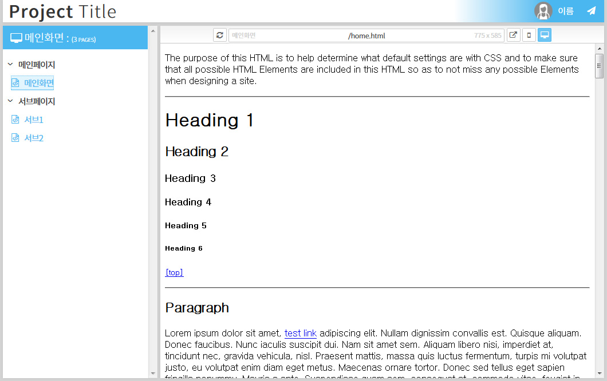

# D2W 퍼블리싱 리스트

본 파일은 퍼블리셔들의 html 파일을 보기 쉽게 정리해 볼 수 있는 html 파일로 기획자, 개발자, 디자이너들에게 퍼블리싱 리스트를 공유하고 참조하기 위한 목적으로 개발되었습니다.



폰트는 [@UYEONG](https://github.com/UYEONG) 님의 [본고딕 서브셋폰트](https://github.com/UYEONG/NotoSans-subset) 를 적용했으며, 아이콘은 [font awesome](https://fortawesome.github.io/Font-Awesome/)의 4.5.0 버전을 적용했습니다.

모바일 보기 버튼과 데스크탑 보기 버튼으로 경우에 맞게 디자인 확인이 가능합니다. 기본은 데스크탑으로 열리며, 처음부터 모바일 화면으로 보이게 하려면 아래 '모바일로 보기' 항목을 확인하세요.

**(모바일 보기 옵션은 실제 기기별 특성 등은 반영하지 않는 디자인 확인용입니다.)**

## 맞춤 수정할 부분

기본적으로 html-list.html 내에서 수정해야 할 부분은 프로젝트 타이틀과 퍼블리셔 프로필 부분입니다.

프로젝트 타이틀의 경우 `<h1>Project <span>Title</span></h1>` 으로 디자인되어 있으며 `span` 태그 안의 글씨는 가는 형태의 디자인입니다.

퍼블리셔 프로필은 프로젝트 타이틀 바로 아래 `.author-info` 부분이며, 편하신대로 수정하시면 됩니다.


## 페이지 추가

html-list.html 페이지 하단 page_list의 json 형식으로 title과 url을 추가하면 됩니다.

```
var page_list = { "pages":[
	{ "title":"페이지명", "url":"페이지파일이름" },
    { "title":"페이지명", "url":"페이지파일이름" }
]};
```
 페이지는 순서대로 좌측 메뉴에 노출되며, `url`이 공란인 경우 리스트 상의 제목 디자인 형태로 적용됩니다.

 첫 로딩시 URL이 있는 리스트 중에 첫 번째 html 파일이 먼저 프레임에 노출됩니다.

 
## 모바일로 보기

기본적으로 퍼블리싱 리스트 파일은 상단 파일명 주소바 영역의 데스크탑 보기와 모바일 보기 버튼으로 선택하여 확인이 가능합니다.

그러나 모바일 사이트 코딩시 모바일로 바로 보여지는 것을 원하면 html 파일 하단의 mobile 변수를 true로 변경해주면 됩니다.
```
var mobile = true or false;
```

 
## 저작권
[MIT License](https://opensource.org/licenses/MIT)

- **라이선스 및 저작권 명시**(저작권자 명시는 CSS 주석 참조)
- 상업적 이용 가능
- 배포 가능
- 수정 가능
- 사적 이용 가능
- 2차 라이선스 가능
- 보증책임 없음

마음껏 편한대로 수정해 적용하세요 :)

### 저작권자

혹시라도 맥주 한 잔, 혹은 커피 한 잔, 아님 격려의 한 마디를 원하신다면 아래 연락처 중 하나로 메세지를 보내주세요.

- 여준혁(D2W)
- 카카오톡 ID : iyakiggun
- 트위터 https://twitter.com/d2wmaster
- 이메일 [iyakiggun@gmail.com](mailto:iyakiggun@gmail.com)

감사합니다. 즐거운 코딩 하세요.
